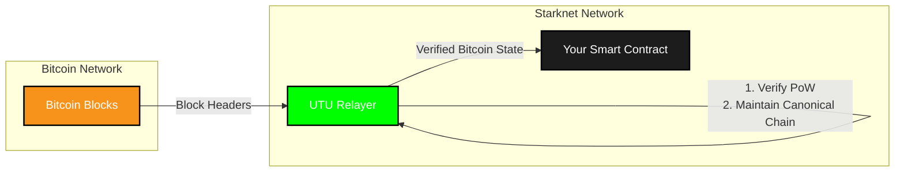

# Introduction to Bitcoin on Starknet

## Understanding the Integration

Bitcoin on Starknet allows Starknet smart contracts to directly verify Bitcoin transactions and state. Developers can build applications that combine Bitcoin's security and network effect with Starknet's programmability and lower fees, without requiring trust in third parties.

## The Utu Relayer: Bridging Two Worlds

Named after the ancient Sumerian sun god who watched over all earthly events, the relayer is a Starknet smart contract which enables secure verification of Bitcoin's state within the Starknet ecosystem through two main functions:

1. **Block Header Verification**: This allows anyone to register Bitcoin block headers on Starknet, verifying and storing the proof-of-work required to mine each block. This ensures that only valid blocks that required significant computational work are accepted.

2. **Canonical Chain Maintenance**: This maps block heights to their corresponding block headers on Starknet, verified using the coinbase transaction. It ensures the strongest proof-of-work chain is maintained, keeping the state coherent with Bitcoin's canonical chain.

This infrastructure enables developers to verify that a bitcoin block header is indeed part of the canonical chain, allowing them to read all information natively included in the block header (like timestamp or difficulty) but also to verify additional data like specific Bitcoin transactions by checking their inclusion proofs against the block's merkle root. To learn more about verifying Bitcoin transactions, please visit the [verifying a transaction page](./verifying_tx).

## Getting Started

To begin using the Bitcoin on Starknet integration, you'll first need to install our JavaScript SDK as described in the [SDK section](../sdk).

Once installed, you can initialize the providers needed to interact with both Bitcoin and the Utu Relayer. Here's how to set it up:
