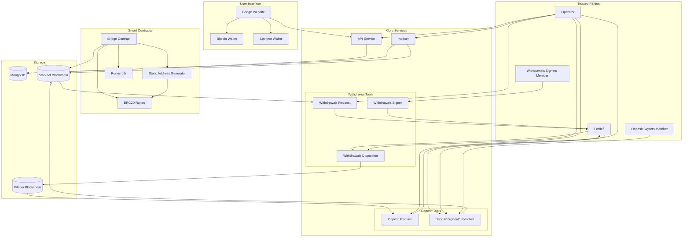

# Introduction to Runes Bridge on Starknet

## Understanding the Bridge

The Utu Runes Bridge enables seamless transfer of Bitcoin Runes between Bitcoin and Starknet networks. Users can deposit Runes to a Bitcoin address and receive corresponding ERC20 tokens on Starknet, which can then be traded or withdrawn back to any Bitcoin address.

## How the Bridge Works

The bridge consists of several interconnected components that work together to enable secure cross-chain transfers:

## Key Features

1. **Deposit Flow**: 
   - Connect your Bitcoin and Starknet wallets
   - Receive a unique Bitcoin deposit address
   - Send Runes to the deposit address
   - Automatically receive equivalent ERC20 tokens on Starknet

2. **Withdrawal Flow**:
   - Burn your Starknet ERC20 tokens
   - Specify a Bitcoin address for receiving Runes
   - Receive your Runes on Bitcoin

## Bridge Components

- **Bridge Contract**: A Starknet smart contract that manages deposits, withdrawals, and ERC20 token minting/burning
- **ERC20 Runes**: Starknet tokens that represent bridged Runes
- **API Service**: Provides access to indexed data and generates deposit addresses
- **Indexer**: Monitors the Starknet blockchain for relevant transactions and events
- **Deposit Tools**:
  - Deposit Request: Submits deposit transactions to Fordefi
  - Deposit Signer/Dispatcher: Receives approval from Fordefi and submits deposit transactions to Starknet
- **Withdrawal Tools**:
  - Withdrawals Request: Submits withdrawal transactions to Fordefi
  - Withdrawals Signer: Approves withdrawal transactions
  - Withdrawals Dispatcher: Receives approval from Fordefi and submits withdrawals to Bitcoin
- **Trusted Parties**:
  - Operator: Manages and monitors core services including API, Indexer, request and sipatcher tools
  - Deposit Signers Member: Authorized entity that interacts with the Deposit Signer
  - Withdrawals Signers Member: Authorized entity that interacts with the Withdrawals Signer
  - Fordefi: Trusted service that coordinates transaction approvals

## Getting Started

To begin using the Runes Bridge, you'll need:

1. A Bitcoin wallet (currently supporting Xverse)
2. A Starknet wallet
3. Runes you wish to bridge

Note: The current bridge interface at [bridge.bitcoin-on-starknet.com](https://bridge.bitcoin-on-starknet.com) is temporary. The official Runes bridge will be integrated into StarkGate, which will be the primary interface for bridging Runes between Bitcoin and Starknet.

For developers interested in integrating with the bridge, please refer to the [Bridge API documentation](./bridge_api).
