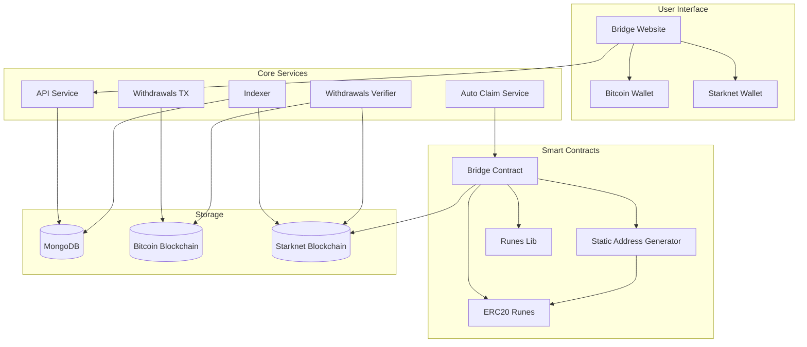

# Introduction to Runes Bridge on Starknet

## Understanding the Bridge

The Utu Runes Bridge enables seamless transfer of Bitcoin Runes between Bitcoin and Starknet networks. Users can deposit Runes to a Bitcoin address and receive corresponding ERC20 tokens on Starknet, which can then be traded or withdrawn back to any Bitcoin address.

## How the Bridge Works

The bridge consists of several interconnected components that work together to enable secure cross-chain transfers:

## Key Features

1. **Deposit Flow**: 
   - Connect your Bitcoin and Starknet wallets
   - Receive a unique Bitcoin deposit address
   - Send Runes to the deposit address
   - Automatically receive equivalent ERC20 tokens on Starknet

2. **Withdrawal Flow**:
   - Burn your Starknet ERC20 tokens
   - Specify a Bitcoin address for receiving Runes
   - Receive your Runes on Bitcoin

## Bridge Components

- **Bridge Contract**: A Starknet smart contract that manages deposits, withdrawals, and ERC20 token minting/burning
- **ERC20 Runes**: Starknet tokens that represent bridged Runes
- **Auto Claim Service**: Automatically processes deposits and mints tokens on Starknet
- **API Service**: Handles deposit address generation and transaction verification

## Getting Started

To begin using the Runes Bridge, you'll need:

1. A Bitcoin wallet (currently supporting Xverse)
2. A Starknet wallet
3. Runes you wish to bridge

Visit the [bridge website](https://bridge.bitcoin-on-starknet.com) to start using the bridge.

For developers interested in integrating with the bridge, please refer to the [Bridge API documentation](./bridge_api).
