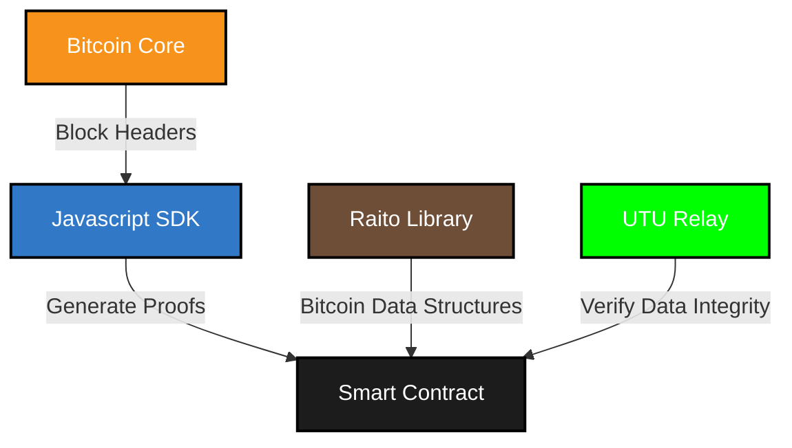

# Software Development Kits

To interact with Bitcoin data on Starknet, you'll need three components:
1. An SDK to generate the necessary proofs from [Bitcoin Core](https://github.com/bitcoin/bitcoin?tab=readme-ov-file#what-is-bitcoin-core).
2. A Cairo library to interpret the Bitcoin data in your smart contracts
3. A relayer service to verify the integrity of the Bitcoin data



## TypeScript/JavaScript SDK

You can install the TypeScript/JavaScript SDK from npm:
```bash
npm install bitcoin-on-starknet
```

## Cairo Library

To work with Bitcoin data structures in your Starknet smart contracts, you can use Raito, a Bitcoin light client developed by the Starkware exploration team. Raito provides Bitcoin data structures in Cairo, allowing you to focus on using Bitcoin data in your smart contracts.

You can find the library on GitHub at [Raito](https://github.com/keep-starknet-strange/raito/)

## Relayer Service

The relayer service is responsible for verifying the integrity of Bitcoin data on Starknet. You can find the implementation at [Utu Relay](https://github.com/lfglabs-dev/utu_relay).

The relayer is deployed at the following addresses:
- Mainnet: [`0x064e21f88caa162294fdda7f73d67ad09b81419e97df3409a5eb13ba39b88c31`](https://voyager.online/contract/0x064e21f88caa162294fdda7f73d67ad09b81419e97df3409a5eb13ba39b88c31)
- Sepolia: [`0x064e21f88caa162294fdda7f73d67ad09b81419e97df3409a5eb13ba39b88c31`](https://sepolia.voyager.online/contract/0x064e21f88caa162294fdda7f73d67ad09b81419e97df3409a5eb13ba39b88c31)
